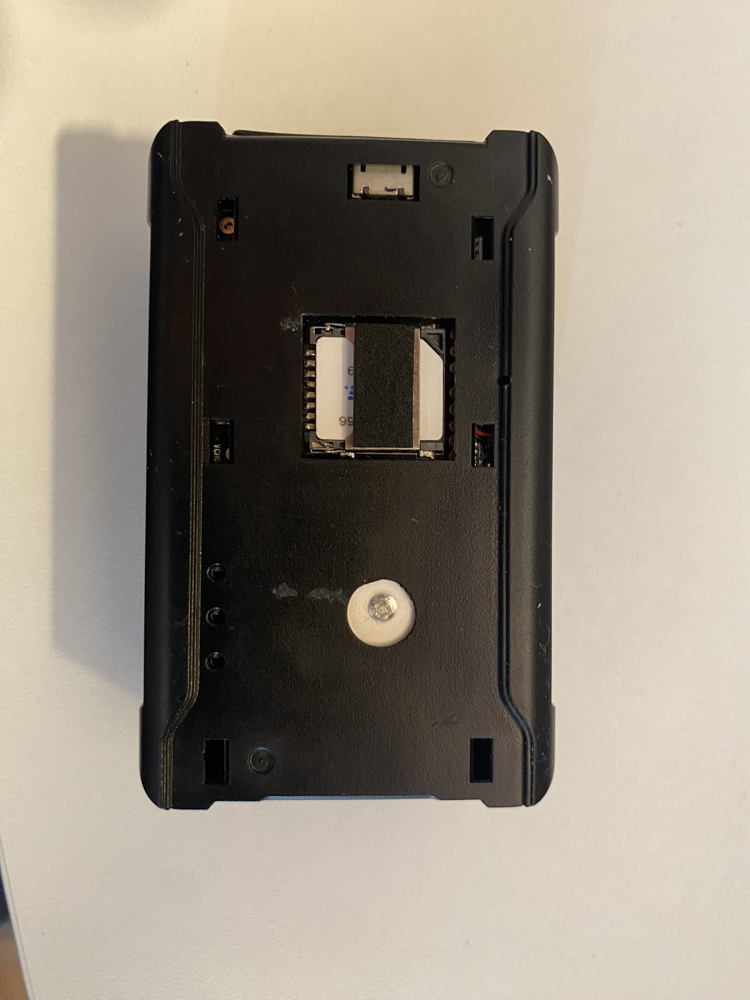
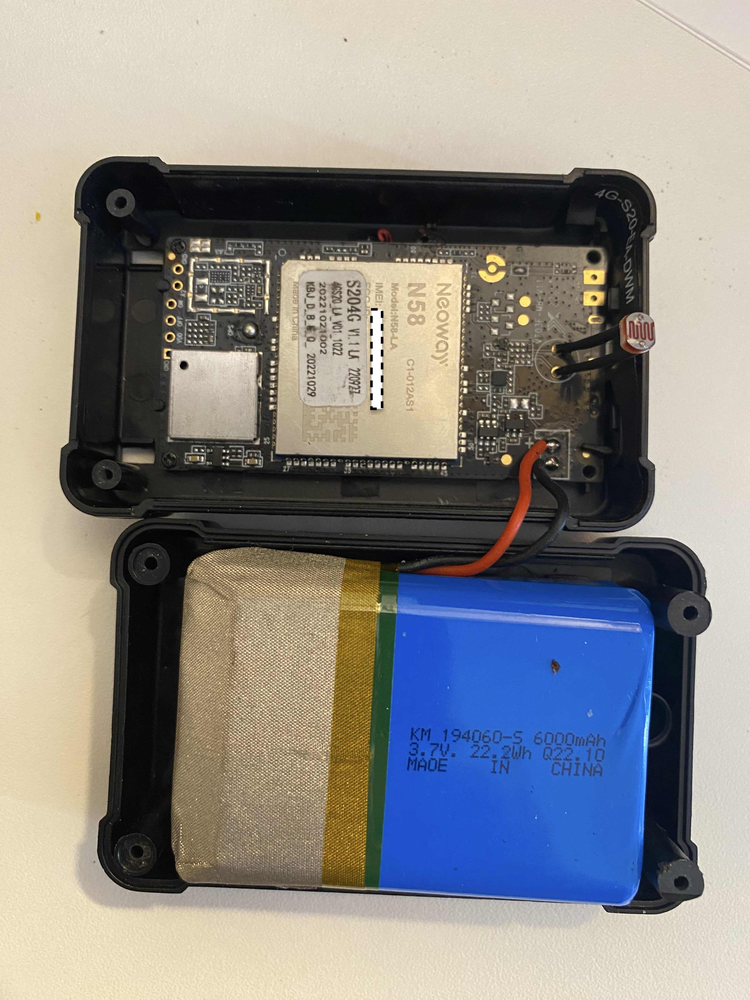
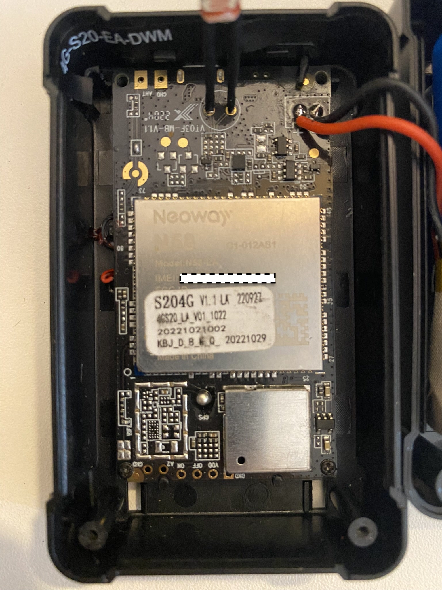
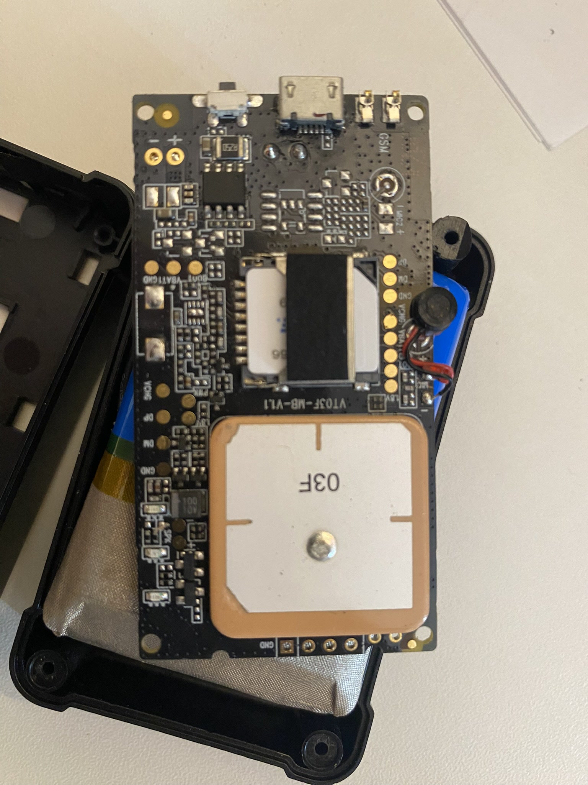

# WanWay Tech (WanWayTech) S20
 Collection of information for the Wanway Tech S20 GPS Tracker

# Background
The WanWay S20 is a popular GPS tracker frequently sold on Amazon on discount at around $10. It is sold as "Subscription required" with included SIM card and preconfigured (and locked) to their GPS service / App.

The S20 model is actually a few different models, the pepper.pl forum below references the 2G/GPRS model mostly, but later references the 4G model which is what Amazon Australia is selling.

# Discovery
## SIM
In Australia the SIM card connects to the Optus network. Trying to send SMS's from the device returns ""nicht moglich" which is German and loosly translates to "not allowed".

APN is set to `A1.net`, Number is `+43` which is Austria

[Celebraces](https://github.com/celebraces) Discovered if you plug the SIM into a standard device some configuration commands are sent on connection that included the unlock command for APN. With some trial and error the unlock command for SERVER was also discovered.

## Replacing the SIM card
Pretty straight forward, remove the sticker and swap out the SIM (Photo lower down)

## Internals:
Runs a Neoway N58 GPS chip, see references below or Neoway-N58 folder for AT commands and USB Drivers.
Can install the [Neoway N58 Drivers](Neoway-N58/Neoway_N58_Signed_Driver_20200629.rar "Neoway N58 Drivers") and connect to the AT serial port to [send AT commands](Neoway-N58/Neoway_N58_AT_Commands_Manual_V1_8_1.pdf "send AT commands").

Model: `S204G`

# Commands
These commands can be sent via SMS to the SIM card you installed, or once connected to a Traccar instance via the "commands" option.
**If you do NOT receive a reply SMS then the command is unrecognised / blocked.**
The tracker is using the gt06 (GT-06) protocol, but does not seem to support all the commands.

See [S20-4G-SMS-COMMANDS](SMS-Commands/S20-4G-SMS-COMMANDS-2022.7.15.pdf) and [S20-SMS-COMMANDS](SMS-Commands/S20-SMS-COMMANDS.pdf) for the "Official" list, but some commands are missing from these documents and can be found below.

## Basic Set up:
* Reset the device to factory defaults `FACTORYALL#` or `FACTORY#`
* Set the the device to point to your own server:  
(If these commands fail then try `LOCKIP,WWDSS20,UNLOCK#` and attempt again)
    * if you are using the IP of the server: `SERVER,0,123.123.123.123,5023,0#`
    * if you prefer to use a domain name: `SERVER,1,example.com,5023,0#`
* Set APN (if required) `APN,apn.net#`
* Set the Timezone `GMT,e,10,0#`
* (If you are getting "carhere" links when sending URL# command, set it to google maps with `LANG,0#`)

## Commands - Device
| Description   |   Command   |   Response    |
|---|---|---|
| Factory Reset | `FACTORYALL#` or `FACTORY#` | `FACTORY_OK, The terminal will restart after 30 seconds!` |
| Reboot Device | `RESET#` | `The terminal will restart after 1 minute!` |

## Commands - Unlocks
If you try to set the server and get the following message `"ERROR:The domain name or IP is locked,not allowed to modify."` try the factory reset commands above, if that still fails try the below commands:
| Description   | Command   |   Response    |   Notes   |
|---|---|---|---|
| Unlock APN    | `LOCKAPN,WWDSS20,UNLOCK#`   |   `UNLOCKAPN_OK`    | |
| Unlock SERVER    | `LOCKIP,WWDSS20,UNLOCK#`   |   `UNLOCKIP_OK`    | Use if SERVER command returns "ERROR:The domain name or IP is locked,not allowed to modify." |

## Commands - Settings
| Description   | Read   |   Response    | Write   |   Response    | Notes |
|---|---|---|---|---|---|
| APN Setting | `APN#` | `Currently in use APN:linksnet,,;` | `APN,{APNname}#` | `APN_OK, The terminal will restart after 30 seconds!` | If you set "UNLOCKAPN" this should automatically configure |
| Set Timezone | `GMT#` | `Currently Timezone(GMT):E,8,0` | `GMT,A,B,C#` | `GMT_OK, The terminal will restart after 30 seconds!` | A: E/W; E East time zone, W West time zone, B: 0~12; time zone, C: 0/15/30/45; Half time zone, `APASETGMTN#` Does not seem to work |
| Set Position Update Interval | `HBT#` | `HBT:3,3;` | `HBT,5,5#` | `HBT_OK` | This is how ofter the tracker uploads data in minutes when NOT moving, set both values the same. |
| Set Language | `LANG#` | `Currently Language:0` | `LANG,0#` | `LANG_OK` | Set 0 for English and 1 for Chinese |
| Set Server (IP) | `SERVER#` | `Currently in use Server:1,WW9016.GPSOG.COM,9016,0;` | `SERVER,0,123.123.123.123,5023,0#` | `SERVER_OK` | Second option is 0 for IP and 1 for domain |
| Set Server (Domain) | `SERVER#` | `Currently in use Server:1,WW9016.GPSOG.COM,9016,0;` | `SERVER,1,example.com,5023,0#` | `SERVER_OK` | Second option is 0 for IP and 1 for domain |
| Power Saving Mode | `SWMODE#` | `Swmode : 0, 0` | `SWMODE,A,B#` | `OK` | A Options, 0:Always On, 1:Power Saving, B Option: Internal in minutes for power saving |
| Set Position Update Interval | `TIMER#` | `Timer:10,10;` | `TIMER,10#` | `Timer:10,10;` | This is how ofter the tracker uploads data in seconds when moving |


## Commands - Alarms
| Description   | Read   |   Response    | Write   |   Response    | Notes |
|---|---|---|---|---|---|
| Add Alarm Notification Number | `SOS#` | `SOS number:,,;` | `SOS,A,Number1,Number2,Number3#` | `OK!SOS1:Number1 SOS2:Number2 SOS3:Number3` | This is the number(s) used if SMS setting is used in an Alarm |
| Delete Alarm Notification Number | `SOS#` | `SOS number:,,;` | `SOS,D,Number1,Number2,Number3#` | `OK!SOS number is empty!` | Use SOS# first to get list of numbers to add to delete list |
| Low Battery Alarm | `BATALM#` | `BATALM: ON, 1` | ON: `BATALM,ON,{0-1}#` OFF: `BATALM,OFF#` | `OK` | Alert Options, 0:GPRS，1:SMS+GPRS |
| Moving Alarm | `MOVING#` | `Moving Switch:OFF;Radius:100m;Alarm Type:0;` | `MOVING,ON,{meters},{0-2}#` | `MOVING_OK` | Set distance in meters before alerting, Alert Options, 0:GPRS，1:SMS+GPRS，2:GPRS+SMS+CALL |
| Tamper Alarm | `RMV#` | `RMV: OFF, 0` | ON: `RMV,ON,{0-1}#` OFF: `RMV,OFF#` | `OK` | Alert Options, 0:GPRS，1:SMS+GPRS，2:GPRS+SMS+CALL |
| Vibration Alarm | `SENALM#` | `SENALM:OFF;` | ON: `SENALM,ON,{0-2}#` OFF: `SENALM,OFF#` | `OK` | Alert Options, 0:GPRS，1:SMS+GPRS，2:GPRS+SMS+CALL |
| Speeding Alarm | `SPEED#` | `SPEED: OFF, 10, 60, 0` | ON: `SPEED,ON,{time},{speed},{0-2}#` OFF: `SPEED,OFF#`  | `SPEEDALM_OK` | Time the Speed is traveled for before triggering. Alert Options, 0:GPRS，1:SMS+GPRS，2:GPRS+SMS+CALL |

## Commands - Information
| Description   | Command   |   Response    |   Notes   |
|---|---|---|---|
| GPRS Settings | `GPRSSET#` | "GPRS:ON;APN:{APNname},,;Server:0,123.123.123.123,5023,0;URL:http://maps.google.com/maps?q=;" | Gets APN and SERVER at same time |
| Get ICCID | `ICCID#` | "ICCID:8931440xxxxxxxx" | |
| Get IMEI | `IMEI#` | "IMEI:8931440xxxxxxxx" | |
| Check Parameters | `PARAM#` | "IMEI:xxxx;IMSI:xxxx;TIMER:10,10;SENDS:3;HBT:3,3;SOS:,,;CENTER:;Sensorset:10,2,3,1;Defense time:10;TimeZone:E,8,0; " | Retrieves multiple Configuration settings at once|
| Check Status | `STATUS#` | "Charging;GPRS:Link Down;NW Signal Level:strong;PPP_STATE:1;GPS:OFF;Defense:OFF;PWRMD:8;" | |
| Get Version | `VERSION#` | "Version: S20_4G_LA_V01_Oct 22 2022_13:49:35" | |
| Last GPS Position (Maps Link) | `URL#` | "<2023-08-27 12:43:43>http://maps.google.com/maps?q=N31.384647,E121.424740" | Set to Google Maps with `LANG,0#` |
| Last GPS Position (Maps Link) | `123#` or `DW#` | "当前位置：DateTime: 2023-08-27 13:47:23 ,http://maps.google.com/maps?q=N31.384647,E121.424740" | This SEEMS to do a location update before sending the URL |
| Last GPS Position (Lat/Long) | `WHERE#` | "Last position!Lat:N31.384647,Lon:E121.424740,Course:0,Speed:0,DateTime:2023-08-27  13:47:23" | |


# Traccar Tweaks
## Filter zero values in Traccar

Sometimes Traccar will show the speed as 0km/h even if the device is moving. This is because the device doesn't always send the speed. To prevent this, you can use add following filter settings in `/opt/traccar/conf/traccar.xml`:
```
<entry key='filter.enable'>true></entry>
<entry key='filter.zero'>true</entry>
<entry key='filter.distance'>5</entry>
```

# Photos
## SIM Slot


## Internals:




# References:
Official Website: https://www.wanwaytech.net/s20_wireless_rechargeable_long_standby_time.html

Traccar Support (Search S20, uses gt06/5023 protocol): https://www.traccar.org/devices/

Unlock Method for 2G model: https://gist.github.com/zayigo/d4ec6f09873df93b22a1fa394838d1ca

Polish Deal site with LOADS of information about the device: https://www.pepper.pl/dyskusji/tracker-gps-wanway-tech-s20-przydatne-informacje-619404

Russian Wholesaler with documentation on Neoway N58 Chip: https://www.wless.ru/technology/?action=details&id=790&pf=tech&pf_id=1&prod=35&tech=2&type=167

